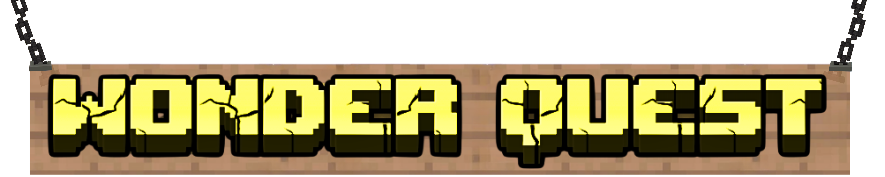

---

# 🚀 Wonder Quest Launcher

Bienvenue sur le dépôt officiel du **Wonder Quest Launcher**, le launcher personnalisé pour rejoindre le serveur Minecraft **Wonder Quest** !  
Facile à utiliser, rapide à installer, et conçu pour vous immerger dans l’univers unique de Wonder Quest dès le lancement.

---

## 🎮 Fonctionnalités

- ⚙️ Installation automatique des mods, ressources et shaders
- 🔐 Connexion sécurisée via compte **Microsoft officiel uniquement**
- 🌍 Accès direct au serveur Wonder Quest sans configuration manuelle
- 🔄 Mise à jour automatique du client à chaque lancement
- 💡 Interface simple et épurée

---

## 🖥️ Prérequis

- **Compte Minecraft Premium (Microsoft obligatoire)**
- Java 17 ou supérieur installé
- Connexion internet stable

---

## 📦 Installation

1. **Téléchargez la dernière version du launcher** :  
   [📥 Télécharger Wonder Quest Launcher](https://example.com/download)

2. **Lancez le fichier `.exe` ou `.jar`**

3. Connectez-vous avec votre **compte Microsoft** Minecraft

4. Cliquez sur **Jouer** pour rejoindre l’univers Wonder Quest 🌟

---

## 🌐 Serveur Wonder Quest

- **IP** : `play.wonderquest.fr`
- **Version** : `1.20.1` (moddé via le launcher)
- **Site officiel** : Bientôt...
- **Discord** : [https://discord.gg/ZdYqBsgaNB](https://discord.gg/ZdYqBsgaNB)

---

## 🔒 Sécurité & confidentialité

✅ Aucune donnée sensible n’est stockée en dehors de votre appareil.  
✅ Connexion OAuth officielle Microsoft (identique à Minecraft Launcher)  
❌ Pas de support pour les comptes crackés (non-premium)

---

## ❓ FAQ

### Le launcher ne démarre pas ?
Vérifiez que Java 17 ou plus est bien installé sur votre système. Téléchargement : [https://adoptium.net/](https://adoptium.net/)

### Impossible de se connecter ?
Assurez-vous que votre compte Minecraft est bien lié à un compte **Microsoft** et que vous êtes en ligne.

---

## 🤝 Contribuer

Les développeurs sont les bienvenus !  
Ouvrez une **issue** pour suggérer une amélioration ou signalez un bug, ou proposez une **pull request** avec vos modifications.

---

## 📄 Licence

Le Wonder Quest Launcher est un logiciel **propriétaire**.  
Tous droits réservés.  
Consultez [LICENSE.md](./LICENSE.md) pour plus d’informations.

---

## 🧡 Remerciements

Merci à tous les joueurs de la communauté Wonder Quest !  
Bon jeu à tous et à très vite en ligne 🌍✨
